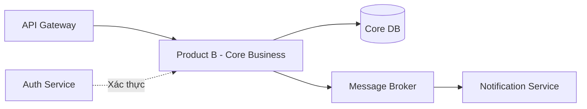

# Service Boundary của nhóm

## 1. Thông tin nhóm

- Tên nhóm: Nhóm 12 (Chủ đề B6)
- Lớp: FIT 4110 (FIT-17-13)
- Thành viên:
  1. Bùi Thế Đạt
  2. Nguyễn Đình Minh Hiếu
  3. Nguyễn Công Hiệp
  4. Nguyễn Văn Trường
- Service nhóm phụ trách: Product B - Core Business (Xây dựng dịch vụ xử lý nghiệp vụ trung tâm)
- Sản phẩm tổng thể của lớp: Hệ thống ứng dụng tổng thể phân tán (Microservices)

## 2. Actor

Ai tương tác với hệ thống/service?
- **Internal Services**: Các service vệ tinh (Frontend Gateway, Notification Service, Payment Service) gửi yêu cầu xử lý nghiệp vụ.
- **Admin/Manager**: Nhân viên quản trị hệ thống theo dõi và điều hành quá trình xử lý trung tâm.

## 3. System Boundary

Nhóm em xây phần nào?
- Hệ thống backend tiếp nhận và thực thi luồng nghiệp vụ lõi (Core Business Workflow).

Phần nhóm kiểm soát:
- Database riêng của Core Business (lưu trạng thái, giao dịch, lịch sử xử lý).
- Logic xử lý nghiệp vụ chính của Product B.
- Các API nội bộ cung cấp cho các service khác.

Phần nhóm chỉ tích hợp:
- Message Queue / Kafka (để gửi và nhận sự kiện - Event).
- Identity Service (Auth) để xác thực và phân quyền (Authorization).
- External API bên thứ 3 (nếu có yêu cầu từ nghiệp vụ).

## 4. Service Boundary

Service của nhóm có trách nhiệm gì?
- Tiếp nhận dữ liệu hoặc yêu cầu nghiệp vụ từ API Gateway/Client.
- Xác thực tính hợp lệ của nghiệp vụ (Business Rule Validation).
- Xử lý trạng thái, tính toán logic lõi và lưu trữ vào Database.
- Phát ra các sự kiện (Events) để các service khác nhận biết và tiếp tục luồng công việc.

Service KHÔNG làm gì?
- KHÔNG quản lý giao diện người dùng (UI Frontend).
- KHÔNG trực tiếp gửi thông báo như Email/SMS (đẩy cho Notification Service).
- KHÔNG quản lý đăng nhập/đăng ký user (do Auth Service đảm nhận).

## 5. Input / Output

### Input

- API Requests (JSON format) chứa thông tin cấu hình và dữ liệu cần xử lý.
- Events từ các service khác gửi đến qua Message Broker.

### Output

- HTTP Response (JSON) trả về trạng thái xử lý thành công/thất bại.
- Message/Events đẩy vào hàng đợi (Queue) báo cáo đã hoàn tất quá trình xử lý (ví dụ: `business.processed`).

## 6. API dự kiến

| Method | Endpoint | Mục đích |
|---|---|---|
| GET | /health | Kiểm tra service có đang hoạt động hay không |
| POST | /api/v1/core/process | Tiếp nhận và xử lý yêu cầu nghiệp vụ mới |
| GET | /api/v1/core/status/{id} | Truy vấn trạng thái của một tiến trình xử lý |
| PUT | /api/v1/core/update/{id} | Cập nhật thông tin/trạng thái xử lý |

## 7. Phụ thuộc service khác

Service này gọi đến service nào?
- **Identity/Auth Service**: Để lấy thông tin xác thực.
- **Notification Service**: Gọi webhook hoặc bắn event qua queue để thông báo cho người dùng.

Service nào gọi đến service này?
- **API Gateway**: Định tuyến request từ Client.
- **Các service vệ tinh khác**: Khi cần truy vấn dữ liệu nghiệp vụ lõi hoặc yêu cầu chạy tiến trình lõi.

## 8. Sơ đồ minh họa

